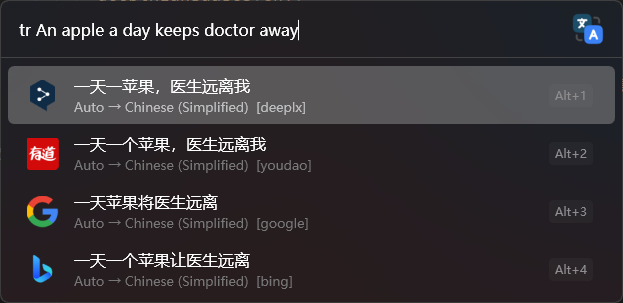

<p align="center">

</p>

<h1 align="center">
MultiTranslate
</h1>

<p align="center">
A Flow-Launcher plugin that translates text using multiple translation services.
</p>

## Supports

### Without configuration
- [Youdao](https://fanyi.youdao.com/)
- [Google](https://translate.google.com/)
- [Baidu](https://fanyi.baidu.com/)
- [Bing](https://www.bing.com/translator)
- [DeepL](https://www.deepl.com/translator)
- [Tencent](https://fanyi.qq.com/)
- [Transmart](https://transmart.qq.com)
- [Caiyun](https://fanyi.caiyunapp.com/)
- [Volcengine](https://translate.volcengine.com/)

> [!IMPORTANT]
> The above services are unofficial. Please use with discretion.

### Requires configuration
- DeepLX (need personal URL)
- [MTranServer](https://github.com/xxnuo/MTranServer) (need personal URL and token)

## Features



``` bash
#  Basic usage
tr <text>

# Specify a target language
tr >fr <text>
# or
tr fr <text>

# Specify a source language
tr zh> <text>

# Both source and target languages
tr zh>fr <text>
```

Just wait for the translation results, and select one of them to copy into the clipboard.

## Configuration

See Flow-Launcher plugin settings page.

### Service Configs

+ DeepLX: Set your DeepLX URL.

```ini
DEEPLX_URL=YOUR_DEEPLX_URL
```

+ MTranServer: Set your MTranServer URL and token.

```ini
MTRAN_SERVER_URL=YOUR_MTRAN_SERVER_URL
MTRAN_SERVER_TOKEN=YOUR_MTRAN_SERVER_TOKEN
```

## Language Codes List

+ I can only ensure the common languages are supported.
+ Each service may support different languages.

```typescript
export const languageCodesArr = [
  'auto',
  'af',
  'sq',
  'am',
  'ar',
  'hy',
  'as',
  'az',
  'bn',
  'ba',
  'eu',
  'bs',
  'bg',
  'yue',
  'ca',
  'zh',
  'zh_hant',
  'zh-Hans',
  'hr',
  'cs',
  'da',
  'prs',
  'dv',
  'nl',
  'en',
  'et',
  'fo',
  'fj',
  'fi',
  'fr',
  'gl',
  'ka',
  'de',
  'el',
  'gu',
  'ht',
  'ha',
  'he',
  'hi',
  'mww',
  'hu',
  'is',
  'ig',
  'id',
  'iu',
  'iu-Latn',
  'ga',
  'it',
  'ja',
  'kn',
  'kk',
  'km',
  'rw',
  'tlh-Latn',
  'tlh-Piqd',
  'ko',
  'ku',
  'ky',
  'lo',
  'lv',
  'lt',
  'mk',
  'mg',
  'ms',
  'ml',
  'mt',
  'mi',
  'mr',
  'mn_cy',
  'mn-Cyrl',
  'mn_mo',
  'my',
  'ne',
  'nb',
  'nb_no',
  'nn_no',
  'or',
  'ps',
  'fa',
  'pl',
  'pt',
  'pt_pt',
  'pt_br',
  'pa',
  'otq',
  'ro',
  'ru',
  'sm',
  'sr-Cyrl',
  'sr-Latn',
  'sd',
  'si',
  'sk',
  'sl',
  'so',
  'es',
  'sv',
  'ty',
  'ta',
  'tt',
  'te',
  'th',
  'bo',
  'ti',
  'to',
  'tr',
  'tk',
  'uk',
  'hsb',
  'ur',
  'ug',
  'uz',
  'vi',
  'cy',
  'xh',
  'yo',
  'yua',
  'zu',
] as const
```

## Thanks

[pot-app](https://github.com/pot-app/pot-desktop)
